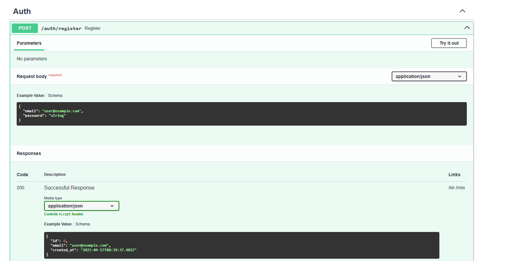
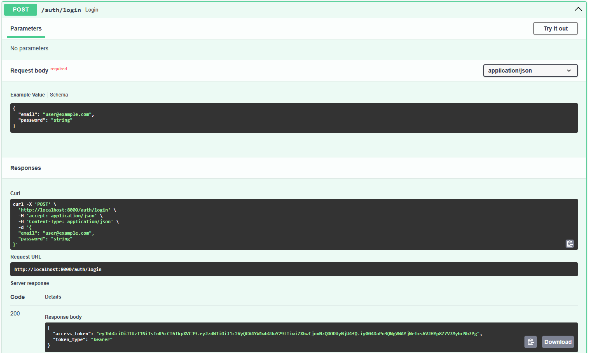
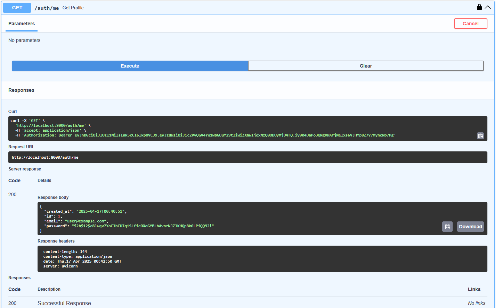
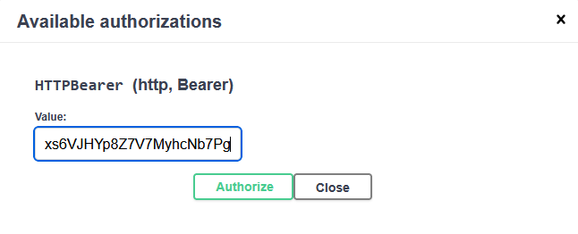

# fastapi-jwt-auth-starter-kit
FastAPI JWT authentication starter kit with login, register, Docker, and bearer token routes

# FastAPI JWT Auth Starter Kit

A plug-and-play authentication microservice built with FastAPI, JWT, and Docker support.

Includes:
- Register/Login routes
- JWT token auth
- Bcrypt password hashing
- Swagger UI + SQLite support

## ⚡ Quick Preview

- `/register`, `/login`, and `/me` routes included
- JWT tokens using `python-jose`
- Dockerized with `.env` support

## 🔍 Preview

**Register route**

**Login route**

**/me route (get user)**

**Token returned**

---

## 📦 Get the Kit

This project is distributed as a downloadable ZIP via Gumroad:

👉 [https://brijac3.gumroad.com/l/jwt-auth-kit](https://brijac3.gumroad.com/l/jwt-auth-kit)

---

## 🔖 Tags

`fastapi` `jwt` `authentication` `starter-kit` `login-system`  
`python` `backend` `docker` `sqlite` `bcrypt` `api-security`
